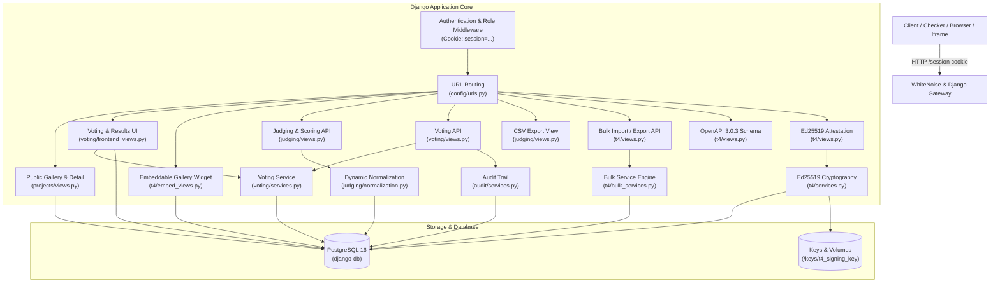
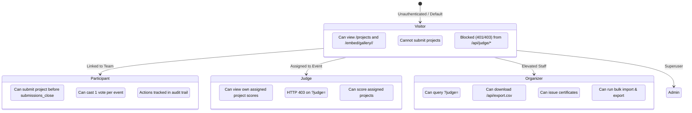
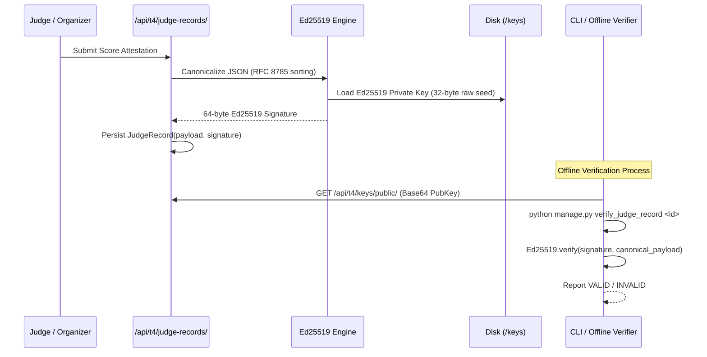

# DOGFOOD 2026 Platform Architecture

## 1. System Overview & Design Philosophy

The DOGFOOD 2026 hackathon portal is a production-grade, offline-first hackathon management platform engineered with **Django 5.x**, **Python 3.11+**, and **PostgreSQL 16**. The architecture emphasizes strict role isolation, deterministic business rules, auditability, cryptographic integrity, and zero third-party client dependencies.

---

## 2. Layered Architectural Decomposition

### 2.1 Presentation & UI Layer
- **Public Project Gallery (`/projects`, `/`)**: Accessible to unauthenticated visitors, rendering project cards with title search (`?q=`) and track filtering (`?track=`).
- **Project Detail Page (`/projects/<id>/`)**: Displays submission information, repository link, team members, and an interactive **Community Comments UI** posting asynchronously to `/api/projects/<id>/comments/`.
- **Community Voting Ballot (`/vote/<event_id>/` & `/vote/link/<token>/`)**:
  - Renders hackathon entries ordered deterministically by the backend SHA-256 seeding service.
  - Supports both authenticated session voting and link/token-based single-use ballot voting.
  - Interactive AJAX voting with automatic form POST fallback and CSRF protection.
- **Results View (`/results/<event_id>/`)**:
  - **Pre-close state**: All vote tallies and rankings are strictly hidden from the HTML DOM; displays a clear explanatory countdown banner.
  - **Post-close state**: Renders backend-verified total vote tallies, participation statistics, and sorted leaderboard.
- **Embeddable Gallery Widget (`/embed/gallery/<event_id>/` & `/embed/gallery.js`)**:
  - Minimalist iframe-ready template displaying public project showcase cards.
  - Framed via `@xframe_options_exempt` and CSP `frame-ancestors *`.
  - Accompanied by a standalone vanilla JavaScript helper (`/embed/gallery.js`) for one-line script embedding.
- **Static Assets**: Handled by **WhiteNoise** (`CompressedManifestStaticFilesStorage`), eliminating external CDN dependencies and guaranteeing fully offline Docker deployments.

### 2.2 REST API Layer (`/api/...`)
Powered by Django REST Framework (DRF) with standard Django `SessionAuthentication`.
- **Judging API (`/api/judge/scores/`)**: Captures rubric evaluations and enforces peer isolation.
- **Voting Endpoints (`/api/vote/` & `/api/vote/link/<token>/`)**: Handles atomic vote casting, duplicate protection, and rate limiting.
- **Results Endpoint (`/api/results/<event_id>/`)**: Returns HTTP 403 (`results_hidden: true`) while voting is open, and full verified tallies after `voting_close`.
- **Export & Import APIs**:
  - `/api/export.csv`: RFC 4180 CSV export of judging scores.
  - `/api/export/bulk/` & `/api/t4/export/`: Sanitized bulk JSON export with zero credential leakage.
  - `/api/import/bulk/` & `/api/t4/import/`: Atomic bulk JSON import supporting dry-run simulation and rollback.
- **OpenAPI Schema (`/api/schema/` & `/api/openapi.json`)**: Machine-readable OpenAPI 3.0.3 specification.
- **Cryptographic Attestations**:
  - `/api/t4/keys/public/`: Active Ed25519 public key.
  - `/api/t4/judge-records/`: Signed participation record generation for judges.
  - `/api/verify/<record_id>/`: Public REST verification endpoint for signed judge records.

### 2.3 Service Layer Pattern
Business logic is decoupled from HTTP view handlers and encapsulated in dedicated, testable service modules:
- **`judging/normalization.py`**: Dynamic Z-score normalization computed at read-time across all completed ballots with mathematical zero-variance safety ($s < 10^{-4} \implies s = 1.0$).
- **`voting/services.py`**: Atomic vote casting, deterministic identity-seeded ballot ordering via SHA-256, active-window results hiding, and cache-based rate limiting.
- **`audit/services.py`**: Immutable audit event logging tracking all state-changing actions, duplicate vote rejections, and access anomalies.
- **`t4/services.py`**: Cryptographic attestation producing deterministic canonical JSON payloads signed with Ed25519 keys, verifiable via REST API or offline CLI.
- **`t4/bulk_services.py`**: Bulk JSON export engine with recursive secret scrubbing, and atomic bulk import engine with whole-payload pre-validation, dry-run simulation, and `external_id` reconciliation.

### 2.4 Data & Constraint Layer
All critical business invariants are enforced directly in the database schema via Django `UniqueConstraint` and `CheckConstraint` declarations.
This guarantees that race conditions, concurrent requests, or application bugs cannot violate structural rules (e.g. duplicate votes, dual identities, or cross-event submissions).

---

## 3. Role-Based Access Control (RBAC) & Backend Isolation

The platform establishes 5 explicit user roles linked via a 1:1 `Profile` relation: `visitor`, `participant`, `judge`, `organizer`, and `admin`.

### Backend Role Isolation Details (T2)
1. **Unauthenticated Access**: Any request to `/api/judge/scores/` without an active session immediately yields `401 Unauthorized`.
2. **Participant & Visitor Blocking**: If `profile.role` is not in `['judge', 'organizer', 'admin']`, access is terminated with `403 Forbidden`.
3. **Peer Isolation**: When a judge requests `/api/judge/scores/?judge=<target>`, the backend checks if `<target>` matches `request.user.username` or `request.user.id`. If mismatched and the requester is neither `organizer` nor `admin`, the backend rejects the request with `403 Forbidden`. Peer judge score leakage is strictly prevented.
4. **Administrative Oversight**: Organizers and admins retain global visibility and can inspect any judge's score breakdown.

---

## 4. Concurrency, Locking, & Transaction Management

To prevent double-voting and race conditions under concurrent network requests:
- **Authenticated Voting**: Guarded by a database-level `UniqueConstraint(fields=["project", "voter"], condition=Q(voter__isnull=False))` and atomic transaction checks.
- **Link-Based Token Voting**: The token record is acquired using `VotingToken.objects.select_for_update()` inside a `transaction.atomic()` block. If `used_at` is already set or a vote exists for the token, the transaction aborts and logs `VOTE_DUPLICATE_BLOCKED` to the audit log.
- **Database Engine Rationale**: In PostgreSQL 16 (production), MVCC and row-level locks allow high-throughput concurrent voting across threads without table locking.

---

## 5. Offline Verification & Cryptographic Architecture (T4)

1. **Deterministic Canonicalization**: Dictionaries are serialized using sorted keys (`sort_keys=True`), compact delimiters (`separators=(',', ':')`), and UTF-8 encoding without whitespace.
2. **Key Storage**: The 32-byte Ed25519 seed is stored with strict file permissions (`0600`) in Docker volume `/keys/t4_signing_key`.
3. **Offline CLI Verification**: Any third party can verify records completely offline without network access using `python manage.py verify_judge_record <id>` and the published public key.

---

## 6. Embeddable Widget Framing Architecture (T4)

- **Framing Isolation**: Django's default `XFrameOptionsMiddleware` sends `X-Frame-Options: DENY` on all responses to protect against clickjacking attacks.
- **Targeted Exemption**: The public embed route (`/embed/gallery/<event_id>/`) and helper script (`/embed/gallery.js`) are decorated with `@xframe_options_exempt` and attach `Content-Security-Policy: frame-ancestors *`.
- **Global Defense Preserved**: Every other route across the platform (galleries, voting, admin, auth, APIs) continues to strictly enforce `X-Frame-Options: DENY`.
- **Public-Safe Data Boundary**: The embed view constructs an isolated, sanitised data dictionary containing only public event/project attributes, guaranteeing zero leakage of judge scores, tokens, private keys, or invite codes.

---

## 7. Failure Recovery & Graceful Degradation

- **Zero-Variance Protection**: Normalization gracefully falls back to $s = 1.0$ if a judge gives uniform scores, preventing runtime `ZeroDivisionError`.
- **Stateless Web Nodes**: WhiteNoise serves pre-compressed assets (`gzip` and `brotli`) without requiring an external asset proxy.
- **Session Restoration**: `manage.py create_checker_sessions` and `manage.py seed_fixtures` operate idempotently, allowing container restarts to resume immediately from existing state without database inconsistency.
- **Transactional Rollback**: Bulk import operations execute within `transaction.atomic()` with whole-payload pre-validation, ensuring zero partial state corruption on invalid input.
