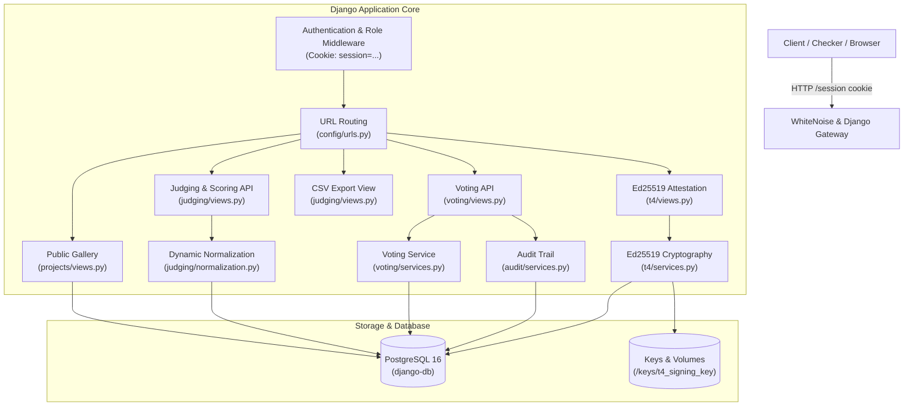
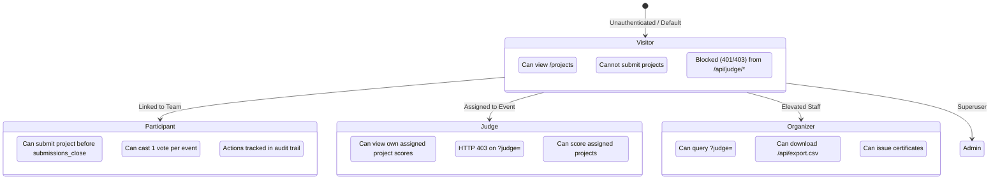
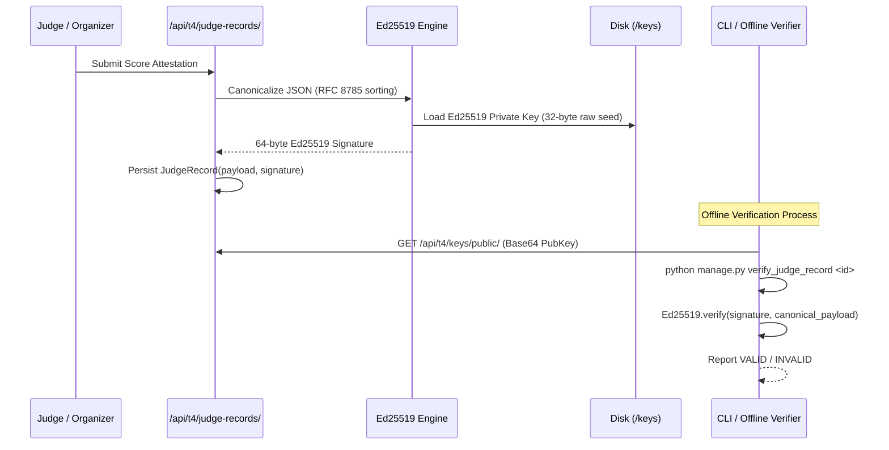

# DOGFOOD 2026 Platform Architecture

## 1. System Overview & Design Philosophy

The DOGFOOD 2026 hackathon portal is a production-grade, offline-first hackathon management platform engineered with **Django 5.x**, **Python 3.11+**, and **PostgreSQL 16**. The architecture emphasizes strict role isolation, deterministic business rules, auditability, cryptographic integrity, and zero third-party client dependencies.

---

## 2. Layered Architectural Decomposition

### 2.1 Presentation & Routing Layer
- **Public Surface (`/projects`, `/`)**: Publicly accessible without authentication, rendering submitted hackathon entries using server-rendered Django templates and vendored Bootstrap static assets.
- **REST API Endpoints (`/api/...`)**: Powered by Django REST Framework (DRF) with `SessionAuthentication`. All mutating requests and sensitive queries enforce strict HTTP 401 (unauthenticated) and HTTP 403 (forbidden) status semantics.
- **Static Assets**: Handled by **WhiteNoise** (`CompressedManifestStaticFilesStorage`), eliminating external CDN dependencies and guaranteeing fully offline Docker deployments.

### 2.2 Service Layer Pattern
Business logic is decoupled from HTTP view handlers and encapsulated in dedicated, testable service modules:
- **`judging/normalization.py`**: Dynamic Z-score normalization computed at read-time across all completed ballots with mathematical zero-variance safety ($s < 10^{-4} \implies s = 1.0$).
- **`voting/services.py`**: Atomic vote casting, deterministic identity-seeded ballot ordering via SHA-256, and tamper-proof active-window results hiding.
- **`audit/services.py`**: Immutable audit event logging tracking all state-changing actions, duplicate vote rejections, and access anomalies.
- **`t4/services.py`**: Cryptographic attestation producing deterministic canonical JSON payloads signed with Ed25519 keys, verifiable via REST API or offline CLI.

### 2.3 Data & Constraint Layer
- All critical business invariants are enforced directly in the database schema via Django `UniqueConstraint` and `CheckConstraint` declarations.
- Prevents race conditions and bypasses at the database boundary, ensuring that application bugs cannot violate structural rules (e.g. duplicate votes, dual identities, or cross-event submissions).

---

## 3. Role-Based Access Control (RBAC) & Backend Isolation

The platform establishes 5 explicit user roles linked via a 1:1 `Profile` relation: `visitor`, `participant`, `judge`, `organizer`, and `admin`.

### Backend Role Isolation Details (T2)
1. **Unauthenticated Access**: Any request to `/api/judge/scores/` without an active session immediately yields `401 Unauthorized`.
2. **Participant & Visitor Blocking**: If `profile.role` is not in `['judge', 'organizer', 'admin']`, access is terminated with `403 Forbidden`.
3. **Peer Isolation**: When a judge requests `/api/judge/scores/?judge=<target>`, the backend checks if `<target>` matches `request.user.username` or `request.user.id`. If mismatched and the requester is neither `organizer` nor `admin`, the backend rejects the request with `403 Forbidden`. Peer judge score leakage is strictly prevented.
4. **Administrative Oversight**: Organizers and admins retain global visibility and can inspect any judge's score breakdown.

---

## 4. Concurrency, Locking, & Transaction Management

To prevent double-voting and race conditions under concurrent network requests:
- **Authenticated Voting**: Guarded by a database-level `UniqueConstraint(fields=["project", "voter"], condition=Q(voter__isnull=False))` and an atomic transaction check.
- **Link-Based Token Voting**: The token record is acquired using `VotingToken.objects.select_for_update()` inside a `transaction.atomic()` block. If `used_at` is already set or a vote exists for the token, the transaction aborts and logs `VOTE_DUPLICATE_BLOCKED` to the audit log.
- **Database Engine Rationale**: In PostgreSQL 16 (production), MVCC and row-level locks allow high-throughput concurrent voting across threads without table locking. (In SQLite, file-level write locking serializes transactions).

---

## 5. Offline Verification & Cryptographic Architecture (T4)

1. **Deterministic Canonicalization**: Dictionaries are serialized using sorted keys (`sort_keys=True`), compact delimiters (`separators=(',', ':')`), and UTF-8 encoding without whitespace.
2. **Key Storage**: The 32-byte Ed25519 seed is stored with strict file permissions (`0600`) in Docker volume `/keys/t4_signing_key`.
3. **Offline CLI Verification**: Any third party can verify records completely offline without network access using `python manage.py verify_judge_record <id>` and the published public key.

---

## 6. Failure Recovery & Graceful Degradation

- **Zero-Variance Protection**: Normalization gracefully falls back to $s = 1.0$ if a judge gives uniform scores, preventing runtime `ZeroDivisionError`.
- **Stateless Web Nodes**: WhiteNoise serves pre-compressed assets (`gzip` and `brotli`) without requiring an external asset proxy.
- **Session Restoration**: `manage.py create_checker_sessions` and `manage.py seed_fixtures` operate idempotently, allowing container restarts to resume immediately from existing state without database inconsistency.
