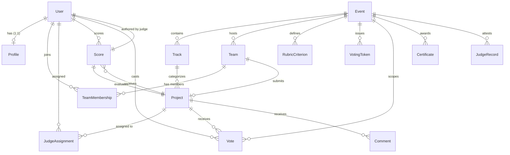

# DOGFOOD 2026 Data Model & Schema Specification

## 1. Entity-Relationship Overview

The DOGFOOD 2026 data model is designed to enforce domain boundaries and integrity rules directly in the database layer.

---

## 2. Core Entities by Application Domain

### 2.1 Accounts & Authorization (`accounts`)
#### `Profile`
- **Fields:**
  - `user`: OneToOneField(`auth.User`, on_delete=CASCADE, related_name='profile')
  - `role`: CharField(max_length=20, choices=[`visitor`, `participant`, `judge`, `organizer`, `admin`], default=`visitor`)
- **Purpose:** Extends Django's standard User model to enforce application-wide RBAC.

---

### 2.2 Events & Tracks (`events`)
#### `Event`
- **Fields:**
  - `name`: CharField(max_length=255)
  - `submissions_close`: DateTimeField(help_text="Deadline after which submissions are rejected")
  - `voting_close`: DateTimeField(help_text="Deadline when public voting closes and results become visible")
  - `external_id`: CharField(max_length=64, null=True, blank=True, db_index=True)
- **Lifecycle Invariants:**
  - When `timezone.now() >= submissions_close`, project creation and editing are blocked.
  - When `timezone.now() < voting_close`, voting results are strictly hidden from participants and visitors.

#### `Track`
- **Fields:**
  - `event`: ForeignKey(`Event`, on_delete=CASCADE, related_name='tracks')
  - `name`: CharField(max_length=255)
  - `external_id`: CharField(max_length=64, null=True, blank=True)

---

### 2.3 Teams & Formation (`teams`)
#### `Team`
- **Fields:**
  - `event`: ForeignKey(`Event`, on_delete=CASCADE, related_name='teams')
  - `name`: CharField(max_length=255)
  - `invite_code`: CharField(max_length=32, unique=True)
  - `external_id`: CharField(max_length=64, null=True, blank=True)

#### `TeamMembership`
- **Fields:**
  - `team`: ForeignKey(`Team`, on_delete=CASCADE, related_name='memberships')
  - `user`: ForeignKey(`auth.User`, on_delete=CASCADE, related_name='team_memberships')
  - `role`: CharField(max_length=20, default='member')
- **Constraints:** `UniqueConstraint(fields=['team', 'user'], name='unique_team_user')`

---

### 2.4 Projects & Submissions (`projects`)
#### `Project`
- **Fields:**
  - `team`: ForeignKey(`Team`, on_delete=CASCADE, related_name='projects')
  - `track`: ForeignKey(`Track`, on_delete=CASCADE, related_name='projects')
  - `title`: CharField(max_length=255)
  - `summary`: TextField()
  - `repo_url`: URLField()
  - `status`: CharField(max_length=20, choices=[`draft`, `submitted`], default=`draft`)
  - `submitted_at`: DateTimeField(null=True, blank=True)
  - `external_id`: CharField(max_length=64, null=True, blank=True, db_index=True)
- **Model Invariants:**
  - `clean()` enforces that `team.event_id == track.event_id`, preventing cross-event track assignments.
  - Requires valid `repo_url` and `summary` before submission.

---

### 2.5 Judging & Scoring Engine (`judging`)
#### `RubricCriterion`
- **Fields:**
  - `event`: ForeignKey(`Event`, on_delete=CASCADE, related_name='rubric_criteria')
  - `name`: CharField(max_length=100)
  - `weight`: FloatField(default=1.0)
- **Constraints:** `UniqueConstraint(fields=['event', 'name'], name='unique_event_criterion_name')`

#### `JudgeAssignment`
- **Fields:**
  - `judge`: ForeignKey(`auth.User`, on_delete=CASCADE, related_name='judge_assignments')
  - `project`: ForeignKey(`projects.Project`, on_delete=CASCADE, related_name='judge_assignments')
- **Constraints:** `UniqueConstraint(fields=['judge', 'project'], name='unique_judge_project_assignment')`

#### `Score`
- **Fields:**
  - `judge`: ForeignKey(`auth.User`, on_delete=CASCADE, related_name='scores')
  - `project`: ForeignKey(`projects.Project`, on_delete=CASCADE, related_name='scores')
  - `criteria_scores`: JSONField(default=dict, help_text='Mapping of criterion name to integer score')
  - `comment`: TextField(blank=True, default='')
  - `updated_at`: DateTimeField(auto_now=True)
- **Constraints:** `UniqueConstraint(fields=['judge', 'project'], name='unique_judge_project_score')`

---

### 2.6 Community Voting & Comments (`voting`)
#### `VotingToken`
- **Fields:**
  - `event`: ForeignKey(`Event`, on_delete=CASCADE, related_name='voting_tokens')
  - `email`: EmailField()
  - `token`: CharField(max_length=64, unique=True)
  - `used_at`: DateTimeField(null=True, blank=True)

#### `Vote`
- **Fields:**
  - `event`: ForeignKey(`Event`, on_delete=CASCADE, related_name='votes')
  - `project`: ForeignKey(`Project`, on_delete=CASCADE, related_name='votes')
  - `voter`: ForeignKey(`auth.User`, null=True, blank=True, on_delete=CASCADE, related_name='votes')
  - `voting_token`: ForeignKey(`VotingToken`, null=True, blank=True, on_delete=CASCADE, related_name='votes')
  - `created_at`: DateTimeField(auto_now_add=True)
- **Declarative DB Constraints:**
  1. `unique_vote_per_user`: `UniqueConstraint(fields=['project', 'voter'], condition=Q(voter__isnull=False))`
  2. `unique_vote_per_token`: `UniqueConstraint(fields=['project', 'voting_token'], condition=Q(voting_token__isnull=False))`
  3. `vote_exactly_one_identity`: `CheckConstraint((Q(voter__isnull=False) & Q(voting_token__isnull=True)) | (Q(voter__isnull=True) & Q(voting_token__isnull=False)))`
  4. `unique_vote_per_token_total`: `UniqueConstraint(fields=['voting_token'], condition=Q(voting_token__isnull=False))`
  5. `clean()` validation: Asserts `Vote.event == Vote.project.team.event`.

#### `Comment`
- **Fields:**
  - `project`: ForeignKey(`Project`, on_delete=CASCADE, related_name='comments')
  - `author_name`: CharField(max_length=255)
  - `text`: TextField()
  - `created_at`: DateTimeField(auto_now_add=True)

---

### 2.7 Audit Trail & Cryptographic Attestations (`audit`, `t4`)
#### `AuditEvent`
- **Fields:**
  - `timestamp`: DateTimeField(auto_now_add=True, db_index=True)
  - `actor`: CharField(max_length=255)
  - `action`: CharField(max_length=100, db_index=True)
  - `target`: CharField(max_length=255)
  - `metadata`: JSONField(default=dict)

#### `JudgeRecord`
- **Fields:**
  - `judge`: ForeignKey(`auth.User`, on_delete=CASCADE, related_name='judge_records')
  - `event`: ForeignKey(`Event`, on_delete=CASCADE, related_name='judge_records')
  - `payload`: JSONField(help_text='Canonicalized score and review snapshot')
  - `signature`: BinaryField(help_text='64-byte Ed25519 signature')
  - `created_at`: DateTimeField(auto_now_add=True)

---

## 3. Data Ingestion & Export Pipelines

### 3.1 Fixture Ingestion Flow (`seed_fixtures`)
The management command `python manage.py seed_fixtures` reads `fixtures.json` idempotently:
1. Loads or updates the target `Event`.
2. Matches or registers `Track` entities by name and external ID.
3. Provisions `Team` records linked to the target event.
4. Populates `Project` submissions with tracks, summaries, and repositories.
5. Employs `update_or_create` semantics to allow safe repeated executions.

### 3.2 CSV Export Pipeline (`/api/export.csv`)
- **Access Rule:** Requires role `organizer` or `admin`.
- **Content Type:** `text/csv` with header `Content-Disposition: attachment; filename="results.csv"`.
- **Columns:** `project_id,project_title,track,submitted_at,review_count`
- **Implementation:** Iterates over all projects in the event, annotates `review_count` via `Count('scores')`, escapes special characters (commas, quotes) according to RFC 4180 via Python standard library `csv.writer`, and flushes as an HTTP response.
