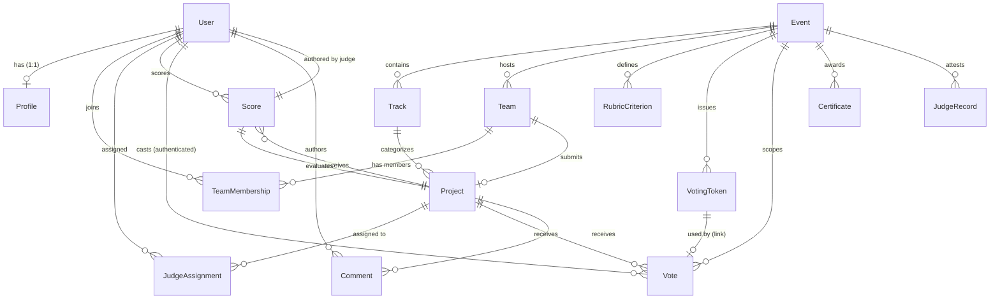

# DOGFOOD 2026 Data Model & Schema Specification

## 1. Entity-Relationship Overview

The DOGFOOD 2026 data model is designed to enforce domain boundaries and integrity rules directly in the database layer.



---

## 2. Core Entities by Application Domain

### 2.1 Accounts & Authorization (`accounts`)
#### `Profile`
- **Fields:**
  - `user`: OneToOneField(`auth.User`, on_delete=CASCADE, related_name='profile')
  - `role`: CharField(max_length=20, choices=[`visitor`, `participant`, `judge`, `organizer`, `admin`], default=`visitor`)
- **Purpose:** Extends Django's standard User model to enforce application-wide RBAC.

---

### 2.2 Events & Tracks (`events`)
#### `Event`
- **Fields:**
  - `name`: CharField(max_length=255)
  - `submissions_close`: DateTimeField(help_text="Deadline after which submissions are rejected")
  - `voting_close`: DateTimeField(null=True, blank=True, help_text="Deadline when public voting closes and results become visible")
  - `voting_mode`: CharField(max_length=16, choices=[`authenticated`, `link`], default=`authenticated`)
  - `external_id`: CharField(max_length=64, null=True, blank=True, unique=True)
- **Lifecycle Invariants:**
  - When `timezone.now() >= submissions_close`, project creation and editing are blocked.
  - When `timezone.now() < voting_close`, voting results are strictly hidden from participants and visitors (`results_hidden: true`).

#### `Track`
- **Fields:**
  - `event`: ForeignKey(`Event`, on_delete=CASCADE, related_name='tracks')
  - `name`: CharField(max_length=255)
  - `external_id`: CharField(max_length=64, null=True, blank=True, unique=True)

---

### 2.3 Teams & Formation (`teams`)
#### `Team`
- **Fields:**
  - `event`: ForeignKey(`Event`, on_delete=CASCADE, related_name='teams')
  - `name`: CharField(max_length=255)
  - `invite_code`: CharField(max_length=64, unique=True)
  - `external_id`: CharField(max_length=64, null=True, blank=True, unique=True)

#### `TeamMembership`
- **Fields:**
  - `team`: ForeignKey(`Team`, on_delete=CASCADE, related_name='memberships')
  - `user`: ForeignKey(`auth.User`, on_delete=CASCADE, related_name='team_memberships')
- **Constraints:** `unique_together = ("team", "user")`

---

### 2.4 Projects & Submissions (`projects`)
#### `Project`
- **Fields:**
  - `team`: ForeignKey(`Team`, on_delete=CASCADE, related_name='projects')
  - `track`: ForeignKey(`Track`, on_delete=CASCADE, related_name='projects')
  - `title`: CharField(max_length=255)
  - `summary`: TextField()
  - `repo_url`: URLField()
  - `status`: CharField(max_length=16, choices=[`draft`, `submitted`], default=`draft`)
  - `submitted_at`: DateTimeField(null=True, blank=True)
  - `external_id`: CharField(max_length=64, null=True, blank=True, unique=True)
- **Model Invariants:**
  - `clean()` enforces that `team.event_id == track.event_id`, preventing cross-event track assignments.
  - Requires valid `repo_url` and `summary` before submission.

---

### 2.5 Judging & Scoring (`judging`)
#### `RubricCriterion`
- **Fields:**
  - `event`: ForeignKey(`Event`, on_delete=CASCADE, related_name='rubric_criteria')
  - `name`: CharField(max_length=255)
  - `weight`: FloatField(default=1.0)

#### `JudgeAssignment`
- **Fields:**
  - `judge`: ForeignKey(`auth.User`, on_delete=CASCADE, related_name='judge_assignments')
  - `project`: ForeignKey(`Project`, on_delete=CASCADE, related_name='judge_assignments')
- **Constraints:** `unique_together = ("judge", "project")`

#### `Score`
- **Fields:**
  - `judge`: ForeignKey(`auth.User`, on_delete=CASCADE, related_name='scores')
  - `project`: ForeignKey(`Project`, on_delete=CASCADE, related_name='scores')
  - `criteria_scores`: JSONField(default=dict)
  - `comment`: TextField(blank=True, default="")
  - `updated_at`: DateTimeField(auto_now=True)
- **Constraints:** `unique_together = ("judge", "project")`

---

### 2.6 Community Voting & Feedback (`voting`)
#### `VotingToken`
- **Fields:**
  - `event`: ForeignKey(`Event`, on_delete=CASCADE, related_name='voting_tokens')
  - `token`: CharField(max_length=64, unique=True, db_index=True)
  - `created_at`: DateTimeField(auto_now_add=True)
  - `used_at`: DateTimeField(null=True, blank=True)
  - `revoked`: BooleanField(default=False)

#### `Vote`
- **Fields:**
  - `event`: ForeignKey(`Event`, on_delete=CASCADE, related_name='votes')
  - `project`: ForeignKey(`Project`, on_delete=CASCADE, related_name='votes')
  - `voter`: ForeignKey(`auth.User`, null=True, blank=True, on_delete=CASCADE, related_name='votes')
  - `voting_token`: OneToOneField(`VotingToken`, null=True, blank=True, on_delete=CASCADE, related_name='vote')
  - `created_at`: DateTimeField(auto_now_add=True)
- **Database Constraints:**
  - `unique_vote_per_user`: `UniqueConstraint(fields=['project', 'voter'], condition=Q(voter__isnull=False))`
  - `unique_vote_per_token_total`: `UniqueConstraint(fields=['voting_token'], condition=Q(voting_token__isnull=False))`
  - `vote_exactly_one_identity`: `CheckConstraint(check=(Q(voter__isnull=False, voting_token__isnull=True) | Q(voter__isnull=True, voting_token__isnull=False)))`

#### `Comment`
- **Fields:**
  - `project`: ForeignKey(`Project`, on_delete=CASCADE, related_name='comments')
  - `author`: ForeignKey(`auth.User`, null=True, blank=True, on_delete=SET_NULL, related_name='comments')
  - `content`: TextField()
  - `created_at`: DateTimeField(auto_now_add=True)

---

### 2.7 Audit Logging (`audit`)
#### `AuditEvent`
- **Fields:**
  - `timestamp`: DateTimeField(auto_now_add=True, db_index=True)
  - `event_type`: CharField(max_length=64, db_index=True)
  - `actor`: ForeignKey(`auth.User`, null=True, blank=True, on_delete=SET_NULL, related_name='audit_events')
  - `ip_address`: GenericIPAddressField(null=True, blank=True)
  - `details`: JSONField(default=dict)

---

### 2.8 Attestations & Certificates (`t4`)
#### `Certificate`
- **Fields:**
  - `event`: ForeignKey(`Event`, on_delete=CASCADE, related_name='certificates')
  - `recipient_name`: CharField(max_length=255)
  - `recipient_email`: EmailField()
  - `track`: ForeignKey(`Track`, null=True, blank=True, on_delete=SET_NULL)
  - `project`: ForeignKey(`Project`, null=True, blank=True, on_delete=SET_NULL)
  - `award_title`: CharField(max_length=255)
  - `issued_at`: DateTimeField(auto_now_add=True)
  - `metadata`: JSONField(default=dict, blank=True)

#### `JudgeRecord`
- **Fields:**
  - `event`: ForeignKey(`Event`, on_delete=CASCADE, related_name='judge_records')
  - `judge`: ForeignKey(`auth.User`, on_delete=CASCADE, related_name='judge_records')
  - `payload`: JSONField()
  - `signature`: BinaryField()
  - `created_at`: DateTimeField(auto_now_add=True)

---

## 3. Bulk Import & Export Data Schema (Person B)

### 3.1 Bulk Export JSON Structure
The bulk export engine (`/api/export/bulk/`) compiles all hackathon data while stripping sensitive secrets:
```json
{
  "version": "1.0",
  "exported_at": "2026-09-29T16:00:00Z",
  "events": [...],
  "tracks": [...],
  "teams": [
    {
      "id": 1,
      "name": "Team Alpha",
      "external_id": "tm_01",
      "event_id": 1,
      "members": ["user_a", "user_b"]
    }
  ],
  "projects": [...],
  "rubric_criteria": [...],
  "judge_assignments": [...],
  "scores": [
    {
      "judge": "judge_a",
      "project_id": 1,
      "criteria_scores": {"innovation": 90.0},
      "comment": "Solid project"
    }
  ]
}
```
*Note: Passwords, password hashes, session cookies, `invite_code` values, voting tokens, and Ed25519 private keys are strictly scrubbed.*

### 3.2 Bulk Import Reconciliation
- Pre-validation verifies existence and cross-references of all foreign keys across the entire JSON payload before executing any database write.
- When `?dry_run=true` is passed, database operations run inside an atomic block that raises a simulated rollback exception, returning full validation feedback without modifying persistent state.
- Matches records by unique `external_id` to update existing entities idempotently or create new records.
