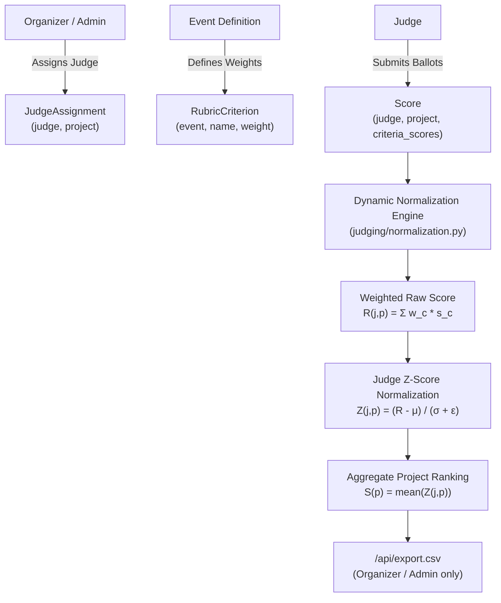

# DOGFOOD 2026 Judging Engine & Normalization Specification

## 1. Judging Workflows & Assignments

The judging system manages rubric-based evaluations submitted by distributed judges across diverse tracks.



### 1.1 Assignment & Score Capture
- **`JudgeAssignment`**: Enforces that judges are explicitly designated to evaluate specific projects.
- **`RubricCriterion`**: Configures multi-dimensional criteria per event (e.g. `Innovation (1.5)`, `Technical Execution (2.0)`, `Presentation (1.0)`).
- **`Score`**: Stores criteria evaluations in `criteria_scores` JSON mapping alongside qualitative comments. Updates are timestamped via `updated_at`.

---

## 2. Backend Role Isolation Architecture

The platform enforces strict role boundaries in `judging/views.py`:

| Role | `GET /api/judge/scores/` | `GET /api/judge/scores/?judge=<self>` | `GET /api/judge/scores/?judge=<peer>` | `GET /api/export.csv` |
| :--- | :---: | :---: | :---: | :---: |
| **Anonymous (Unauthenticated)** | `401 Unauthorized` | `401 Unauthorized` | `401 Unauthorized` | `401 Unauthorized` |
| **Visitor** | `403 Forbidden` | `403 Forbidden` | `403 Forbidden` | `403 Forbidden` |
| **Participant** | `403 Forbidden` | `403 Forbidden` | `403 Forbidden` | `403 Forbidden` |
| **Judge** | `200 OK` (Own scores) | `200 OK` (Own scores) | `403 Forbidden` (Peer Blocked) | `403 Forbidden` |
| **Organizer / Admin** | `200 OK` (All scores) | `200 OK` (Filtered) | `200 OK` (Inspecting peer) | `200 OK` (CSV file) |

### 2.1 Implementation Details
```python
# judging/views.py (snippet)
if not request.user.is_authenticated:
    return Response({"detail": "Authentication credentials were not provided."}, status=401)

user_role = getattr(getattr(request.user, "profile", None), "role", "visitor")
if user_role not in ["judge", "organizer", "admin"]:
    return Response({"detail": "You do not have permission to view scores."}, status=403)

target_judge_param = request.GET.get("judge")
if target_judge_param and user_role == "judge":
    if target_judge_param not in [str(request.user.id), request.user.username]:
        return Response({"detail": "Judges are not allowed to view other judges' scores."}, status=403)
```

---

## 3. Dynamic Normalization Mathematics

Different judges exhibit idiosyncratic grading biases: harsh judges compress scores downward while lenient judges inflate them. To ensure fair cross-track evaluation without storing precomputed biased totals, the platform executes dynamic Z-score normalization at read-time across all completed ballots.

### 3.1 Raw Weighted Score Calculation
For judge $j$ evaluating project $p$, the raw score $R_{j,p}$ is the linear combination of criteria scores weighted by the event rubric:

$$R_{j,p} = \sum_{c \in C} w_c \cdot s_{j,p,c}$$

Where:
- $c \in C$ represents each rubric criterion.
- $w_c$ is the configured criterion weight (defaults to $1.0$ if unweighted).
- $s_{j,p,c}$ is the integer or floating-point score awarded by judge $j$.

### 3.2 Judge Distribution Parameters
For a judge $j$ who has scored a set of projects $P_j$:

$$\mu_j = \frac{1}{|P_j|} \sum_{p \in P_j} R_{j,p}$$

$$\sigma_j = \sqrt{\frac{1}{|P_j|} \sum_{p \in P_j} (R_{j,p} - \mu_j)^2}$$

### 3.3 Zero-Variance Safety & Singular Reviews
A critical numerical instability occurs when:
1. A judge gives identical scores to all evaluated projects ($\sigma_j = 0$).
2. A judge evaluates exactly one project ($|P_j| = 1 \implies \sigma_j = 0$).
3. Floating point inaccuracies yield infinitesimal variance ($\sigma_j < 10^{-4}$).

**Zero-Variance Safety Rule:**
$$\sigma_j^* = \begin{cases} 1.0 & \text{if } \sigma_j < 10^{-4} \\ \sigma_j & \text{otherwise} \end{cases}$$

This guarantees that:
- Division by zero (`ZeroDivisionError`) is mathematically impossible.
- Judges who assign identical scores produce a normalized shift of $0.0$ ($R_{j,p} - \mu_j = 0$).

### 3.4 Normalized Score & Project Aggregation
The Z-score for project $p$ under judge $j$ is:

$$Z_{j,p} = \frac{R_{j,p} - \mu_j}{\sigma_j^* + \epsilon}$$

Where $\epsilon = 10^{-9}$ provides secondary numerical damping.

The final aggregate normalized score $S_p$ for project $p$ averaged across all evaluating judges $J_p$ is:

$$S_p = \frac{1}{|J_p|} \sum_{j \in J_p} Z_{j,p}$$

Projects with zero reviews default to $S_p = 0.0$.

### 3.5 Deterministic Ranking & Tie Breaking
Ranked outputs are ordered by:
1. $S_p$ descending (higher normalized score wins).
2. `submitted_at` ascending (earlier submissions break score ties).
3. `project.id` ascending (guarantees strictly deterministic output).

---

## 4. CSV Export Pipeline Specification

The export route `/api/export.csv` provides organizers and auditors with a structured export of hackathon entries.

### 4.1 Wire Specification
- **Method:** `GET`
- **Route:** `/api/export.csv`
- **Authorization:** `organizer` or `admin` session required.
- **Headers:**
  - `Content-Type: text/csv; charset=utf-8`
  - `Content-Disposition: attachment; filename="results.csv"`
- **Critical Acceptance Requirement:** The first line (header) MUST contain a comma (`,`).

### 4.2 Column Schema
```csv
project_id,project_title,track,submitted_at,review_count
1,"Autonomous Drone Router","AI & Robotics",2026-03-01T14:32:00Z,4
2,"Decentralized Audit Log","Infrastructure",2026-03-01T15:10:15Z,3
```
- RFC 4180 escaping is applied automatically for project titles containing commas, quotes, or newlines.
