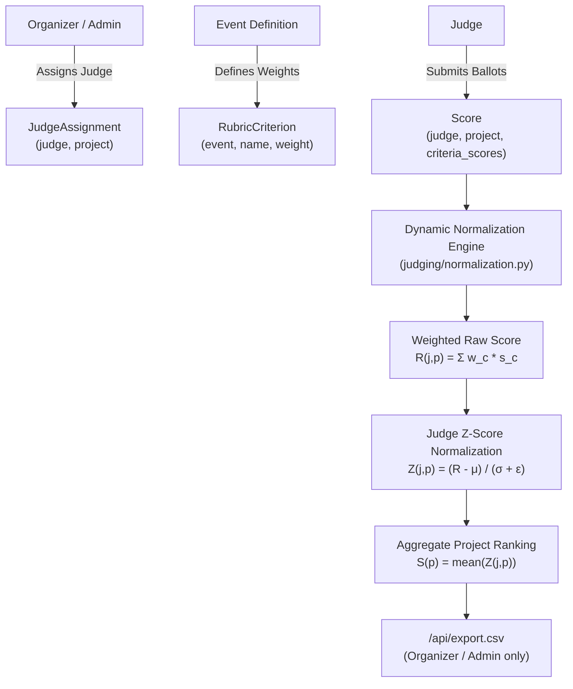

# DOGFOOD 2026 Judging & Voting Engine Specification

## 1. Judging Workflows & Assignments

The judging system manages rubric-based evaluations submitted by distributed judges across diverse tracks.



### 1.1 Assignment & Score Capture
- **`JudgeAssignment`**: Enforces that judges are explicitly designated to evaluate specific projects.
- **`RubricCriterion`**: Configures multi-dimensional criteria per event (e.g. `Innovation (1.5)`, `Technical Execution (2.0)`, `Presentation (1.0)`).
- **`Score`**: Stores criteria evaluations in `criteria_scores` JSON mapping alongside qualitative comments. Updates are timestamped via `updated_at`.

---

## 2. Backend Role Isolation Architecture

The platform enforces strict role boundaries in `judging/views.py`:

| Role | `GET /api/judge/scores/` | `GET /api/judge/scores/?judge=<self>` | `GET /api/judge/scores/?judge=<peer>` | `GET /api/export.csv` |
| :--- | :---: | :---: | :---: | :---: |
| **Anonymous (Unauthenticated)** | `401 Unauthorized` | `401 Unauthorized` | `401 Unauthorized` | `401 Unauthorized` |
| **Visitor** | `403 Forbidden` | `403 Forbidden` | `403 Forbidden` | `403 Forbidden` |
| **Participant** | `403 Forbidden` | `403 Forbidden` | `403 Forbidden` | `403 Forbidden` |
| **Judge** | `200 OK` (Own scores) | `200 OK` (Own scores) | `403 Forbidden` (Peer Blocked) | `403 Forbidden` |
| **Organizer / Admin** | `200 OK` (All scores) | `200 OK` (Filtered) | `200 OK` (Inspecting peer) | `200 OK` (CSV file) |

### 2.1 Implementation Details
```python
# judging/views.py
if not request.user.is_authenticated:
    return Response({"detail": "Authentication credentials were not provided."}, status=401)

user_role = getattr(getattr(request.user, "profile", None), "role", "visitor")
if user_role not in ["judge", "organizer", "admin"]:
    return Response({"detail": "You do not have permission to view scores."}, status=403)

target_judge_param = request.GET.get("judge")
if target_judge_param and user_role == "judge":
    if target_judge_param not in [str(request.user.id), request.user.username]:
        return Response({"detail": "Judges are not allowed to view other judges' scores."}, status=403)
```

---

## 3. Dynamic Normalization Mathematics

Different judges exhibit idiosyncratic grading biases: harsh judges compress scores downward while lenient judges inflate them. To ensure fair cross-track evaluation without storing precomputed biased totals, the platform executes dynamic Z-score normalization at read-time across all completed ballots.

### 3.1 Raw Weighted Score Calculation
For judge $j$ evaluating project $p$, the raw score $R_{j,p}$ is the linear combination of criteria scores weighted by the event rubric:

$$R_{j,p} = \sum_{c \in C} w_c \cdot s_{j,p,c}$$

Where:
- $c \in C$ represents each rubric criterion.
- $w_c$ is the configured criterion weight (defaults to $1.0$ if unweighted).
- $s_{j,p,c}$ is the score awarded by judge $j$.

### 3.2 Judge Distribution Parameters
For a judge $j$ who has scored a set of projects $P_j$:

$$\mu_j = \frac{1}{|P_j|} \sum_{p \in P_j} R_{j,p}$$

$$\sigma_j = \sqrt{\frac{1}{|P_j|} \sum_{p \in P_j} (R_{j,p} - \mu_j)^2}$$

### 3.3 Zero-Variance Safety & Singular Reviews
A critical numerical instability occurs when:
1. A judge gives identical scores to all evaluated projects ($\sigma_j = 0$).
2. A judge evaluates exactly one project ($|P_j| = 1 \implies \sigma_j = 0$).
3. Floating point inaccuracies yield infinitesimal variance ($\sigma_j < 10^{-4}$).

**Zero-Variance Safety Rule:**
$$\sigma_j^* = \begin{cases} 1.0 & \text{if } \sigma_j < 10^{-4} \\ \sigma_j & \text{otherwise} \end{cases}$$

This guarantees:
- Division by zero (`ZeroDivisionError`) is mathematically impossible.
- Judges who assign identical scores produce a normalized shift of $0.0$ ($R_{j,p} - \mu_j = 0$).

### 3.4 Normalized Score & Project Aggregation
The Z-score for project $p$ under judge $j$ is:

$$Z_{j,p} = \frac{R_{j,p} - \mu_j}{\sigma_j^* + \epsilon}$$

Where $\epsilon = 10^{-9}$ provides secondary numerical damping.

The final aggregate normalized score $S_p$ for project $p$ averaged across all evaluating judges $J_p$ is:

$$S_p = \frac{1}{|J_p|} \sum_{j \in J_p} Z_{j,p}$$

---

## 4. Community Voting Engine (T3)

In addition to official judging, the platform features a community voting engine for popular choice awards.

### 4.1 Dual Voting Mechanisms
1. **Authenticated Session Voting (`POST /api/vote/`)**:
   - Requires an authenticated user session (`request.user`).
   - Each user can cast exactly 1 vote per project, and is restricted by event configuration.
2. **Link / Token Voting (`POST /api/vote/link/<token>/`)**:
   - Single-use, cryptographically generated voting tokens (`VotingToken`).
   - Enables anonymous community or guest voting without requiring an account.
   - Enforces immediate consumption: `token.used_at = timezone.now()` within an atomic row lock.

### 4.2 Seeded Ballot Ordering (Anti-Position Bias)
To prevent the first or top projects from gaining an unfair advantage (position bias), the ballot ordering is deterministically seeded per voter:
- **Seed Formula**:
  $$\text{Seed} = \text{SHA-256}(\text{Voter Identity} + \text{Event ID})$$
- The projects list is deterministically sorted using this pseudo-random seed in Python.
- Every voter sees a consistent, reproducible, yet individualized ballot order across page refreshes.

### 4.3 Results Hiding & Active Window Enforcement
- Prior to `event.voting_close`, the results endpoint (`GET /api/results/<event_id>/`) returns:
  ```json
  {
    "detail": "Voting is still active. Results are hidden until voting closes.",
    "results_hidden": true
  }
  ```
  HTTP Status: `403 Forbidden`.
- The frontend results template strictly hides all tally tables and stats before close.
- Once `timezone.now() >= event.voting_close`, results are dynamically calculated from the database and returned with complete vote counts and leaderboard rankings.

### 4.4 Rate Limiting & Audit Trail
- Voting endpoints apply in-memory cache rate limiting per IP / voter identity to mitigate denial-of-service and automated vote-stuffing.
- Every vote cast, duplicate attempt, or validation failure is recorded in `AuditEvent` with IP address, timestamp, and metadata.

---

## 5. Cryptographic Attestation & Offline Verification (T4)

Judges' participation and scoring records can be cryptographically attested using standard Ed25519 digital signatures.

### 5.1 Canonical Serialization (RFC 8785)
To ensure identical hash and signature evaluation across independent implementations:
1. Payloads are formatted as JSON with strictly sorted keys (`sort_keys=True`).
2. Delimiters are compact without whitespace (`separators=(',', ':')`).
3. UTF-8 character encoding is enforced.

### 5.2 Verification Interfaces
1. **Public Key Endpoint**: `GET /api/t4/keys/public/` delivers the active Base64-encoded Ed25519 public key.
2. **REST Verification**: `GET /api/verify/<record_id>/` evaluates the signature against stored payload using the active key and returns `{"valid": true, "record_id": ..., "algorithm": "Ed25519"}`.
3. **Offline CLI Verification**:
   ```bash
   python manage.py verify_judge_record <record_id>
   ```
   Can be run completely disconnected from the network to independently verify tamper resistance.
